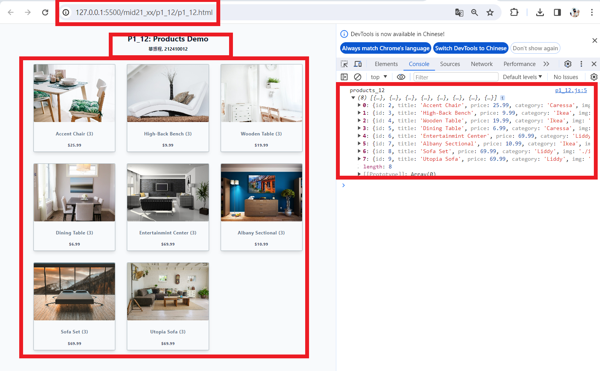
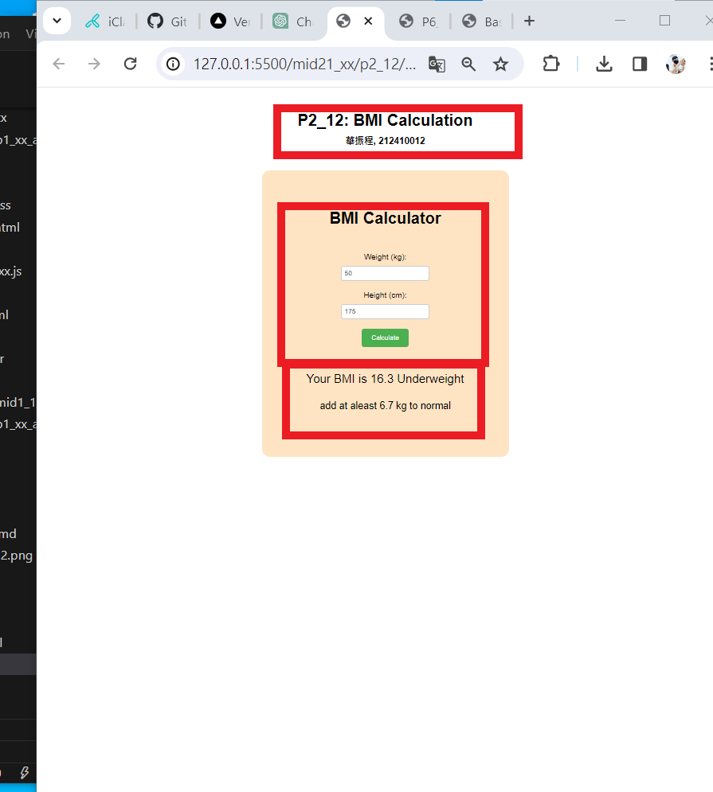
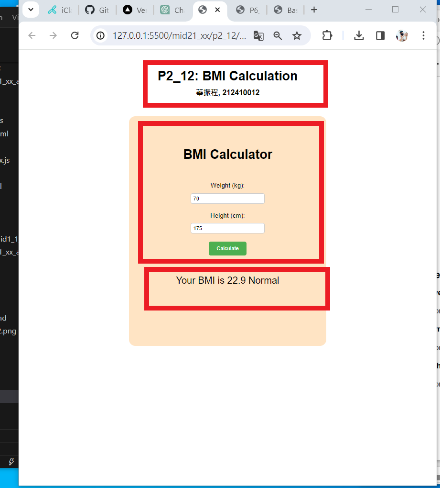
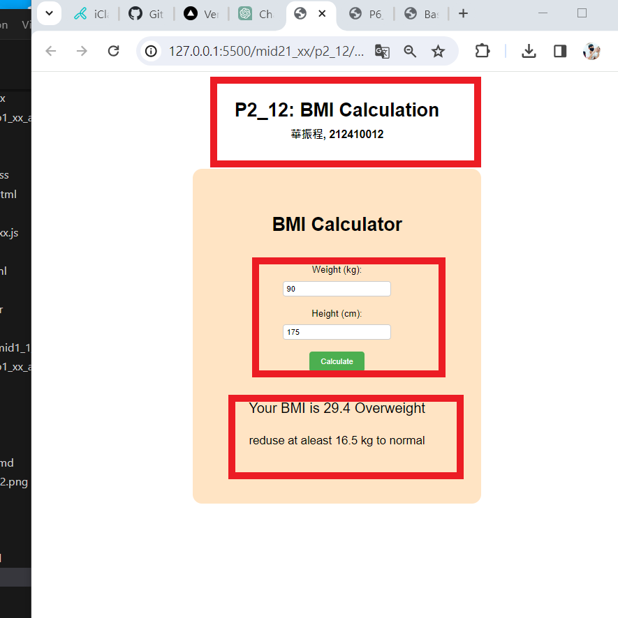
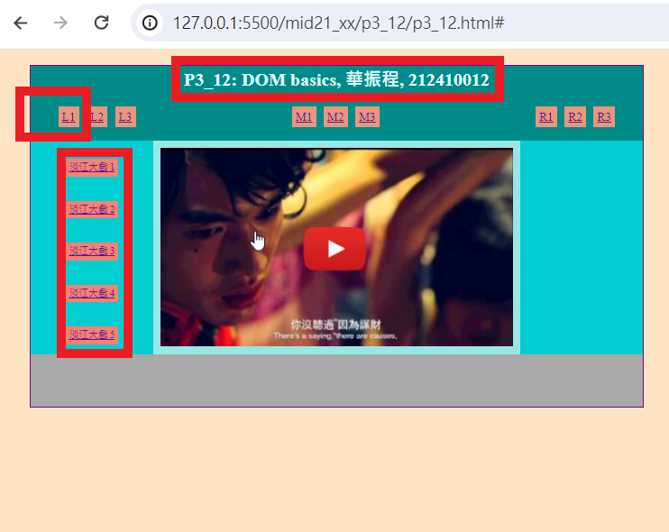
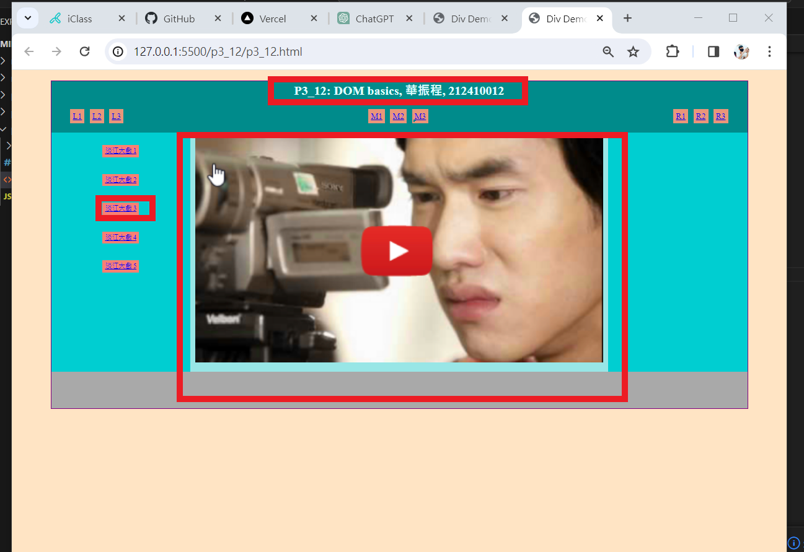
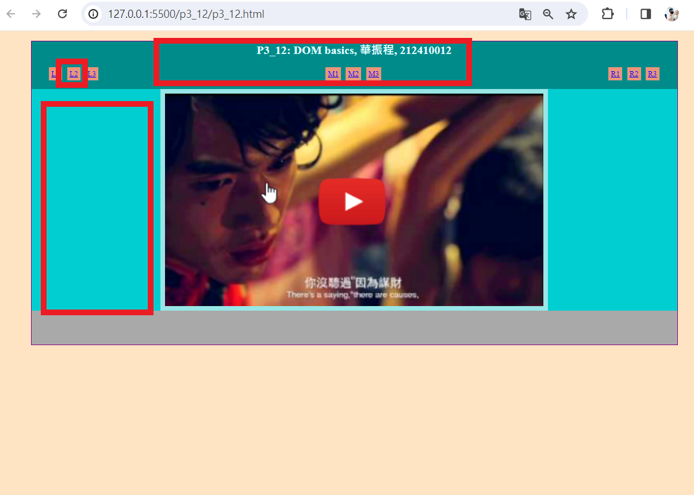

# (30%) JavaScript 網頁設計 1N 期中上機考-2 -- 斷網考試

##### 2024-4-18 at E201

#### Note:

1. 請不要發揮同學愛，作弊雙方除了本次考試 0 分外，平常分數另扣 20 分，情節嚴重者會送校。
2. iClass 上請繳交 mid21_xx.md, mid21_xx.pdf，還有壓縮檔 mid21_xx.zip 3 個檔案
3. 請直接將答案寫在 mid21_xx.md 上，老師實作的圖片放在 mid21_htc.pdf 上，請依照老師所給的圖片來實作並標註
4. 跟期中考相關的檔案及目錄名稱有 xx 時，必須要改成學號後 2 碼，沒有修改時，會視違犯情況扣分。
5. 每一張圖片要有機房左側背景，圖片上要有你的學號(或後兩碼)，圖片標註要跟老師所標註的類似。違者會依情節扣分。
6. 請自評分數，將每一題的 ? 填入分數，沒有填者，不會批改，以 0 分計算。

##### Your (Name, ID): (華振程, 212410012)

##### Mid21 斷網題目 (30%)

- P1 (10%): 10 分
- P2 (10%): 10 分
- P3 (10%): 5 分

##### 總分: 25 分

## (10%) P1: Products Demo -- 透過 JavaScript 來建構

請從 p1_data_xx.js 中之 all_products_xx 陣列產生 8 筆產品資料放入 products_xx 中。第 1 筆之 id 是你學號最後一碼，由此往下找 8 筆，如果學號最後一碼是 0 則從 id=10 產品開始, 取得 10, 11, 12, 1, 2, 3, 4, 5，放入 products_xx 中。

記得，每一項產品名稱後面要顯示產品 id，如第 1 筆的 Albany Sectional (P7)，其中的 P7 就表示產品 id=7


#### Your Answer

##### => Chrome 顯示，如上圖



##### => js code

```
將 p1_xx.js code 放入此
import { products_12, all_products_12 } from './p1_data_12.js';

const productContainer = document.querySelector('.products-container');

console.log('products_12', products_12);

const DisplayProducts = (blogs) => {
  let displayBlogs = blogs
    .map((item) => {
      const { id, img,price, title, category } = item;
      return `
      <div class="single-product">
      
      <footer>
        <h3 class="name">${title} (3)</h3>
        <span class="price">$${price}</span>
      </footer>
    </div>
     `;
    })
    .join('');
    productContainer.innerHTML = displayBlogs;
};
document.addEventListener('DOMContentLoaded', () => {
  DisplayProducts(products_12);
});

```

---

## (10%) P2: DOM 應用 -- BMI 計算

BMI = (體重 / 身高^2)
體重以公斤計算，身高以公尺計算

```
BMI < 18.5         Underweight
18.5 <= BMI <= 24  Normal
BMI > 24           Overweight

```

##### => test for underweight BMI

weight: 50kg
height: 175 cm


##### => test for normal BMI

weight: 70kg
height: 175 cm


##### => test for overweight BMI

weight: 90kg
height: 175 cm


#### Your Answer

##### => test for lower BMI



##### => test for normal BMI



##### => test for higher BMI



```
const calculateBtn = document.querySelector('#calculate');
const bmiResult = document.querySelector('#result');
const suggest = document.querySelector('#suggest');
const weightInput = document.querySelector('#weight');
const heightInput = document.querySelector('#height');

function bmiCalc_xx(height, weight) {
  return weight / (height * height);
}
function bmi_normal_low(height) {
  return 18.5 * (height * height);
}
function bmi_normal_high(height) {
  return 24 * (height * height);
}

function wwInput() {
  return parseFloat(weightInput.value);
}
function hhInput() {
  return parseFloat(heightInput.value);
}

calculateBtn.addEventListener('click', () => {
  height = hhInput().toFixed(2);
  height = height / 100;
  weight = wwInput().toFixed(2);
  console.log("height ", height);
  console.log("weight ", weight);
  bmicalc = bmiCalc_xx(height, weight).toFixed(1);
  if (bmicalc < 18.5) {
    bmiResult.textContent = `Your BMI is ${bmicalc} Underweight`;
    suggest.textContent = `add at aleast ${(bmi_normal_low(height)-weight).toFixed(1)} kg to normal`;
  } else if (bmicalc >= 18.5 && bmicalc < 24) {
    bmiResult.textContent = `Your BMI is ${bmicalc} Normal`;
    suggest.textContent = ``;
  }else if ( bmicalc > 24) {
    bmiResult.textContent = `Your BMI is ${bmicalc} Overweight`;
    suggest.textContent = `reduse at aleast ${(weight-bmi_normal_high(height)).toFixed(1)} kg to normal`;
  }
  
});

```
---


#### (10%) P3: DOM 整合題

##### => 按下左邊 L1 按鈕，會顯現 淡江大戲選單，共 5 個


##### => 按下 淡江大戲 3 按鈕，會顯現淡江大戲 3 的圖片 (images/TKU3.png)


##### => 按下左邊 L2 按鈕，會將淡江大戲選單全部清除


#### Your Answer

##### => 按下左邊 L1 按鈕，會顯現 淡江大戲選單，共 5 個



##### => 按下 淡江大戲 3 按鈕，會顯現淡江大戲 3 的圖片 (images/TKU3.png)



##### => 按下左邊 L2 按鈕，會將淡江大戲選單全部清除



```

function changeImage(index) {
  const player = document.querySelector('#player');
  console.log('player', player);
  switch (index) {
    case 1: {
      console.log('1')      
      break;
    }
    case 2:{
      console.log('2');
      
      break;

    }
    case 3: {
      console.log('3');
      break;

    }
    case 4: {
      console.log('4');
      break;

    }
    case 5: {
      console.log('5');
      break;

    }

  }
}
const main = document.querySelector('.main');
const section = document.querySelector('.section');

function showTKU60() {
  const p = document.querySelector('#menu1');
}

function clearMenu1All() {
  const p = document.querySelector('#menu2');
  main.classList.add('hidden');
  section.classList.add('hidden');
}

```