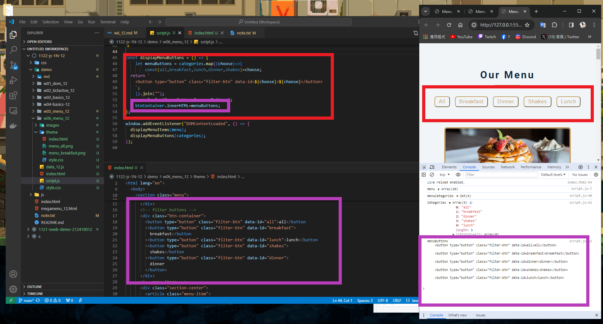

### W06-P1: Create categories dynamically from data_xx.js


```
ed54473 jimmyhua123     Fri Mar 29 12:00:17 2024 +0800  ### W06-P1: Create categories dynamically from data_xx.js
```
### W06-P2: Display Menu buttons from categories array
 
 

```
e5d6681 jimmyhua123     Fri Mar 29 12:53:10 2024 +0800        W06-P2: Display Menu buttons from categories array
```
### W06-P3: implement filter buttons

#### => choose breakfast

 
#### => choose shakes
 

 
#### => choose all
 

 
 
```
d006d15 jimmyhua123     Fri Mar 29 13:13:13 2024 +0800        W06-P3: implement filter buttons
```
### W06-P4: implement open modals
 

```

```

### W06-P5: implement close modals
 

 
```


```
### W06-P6: git logs for W6
```


```