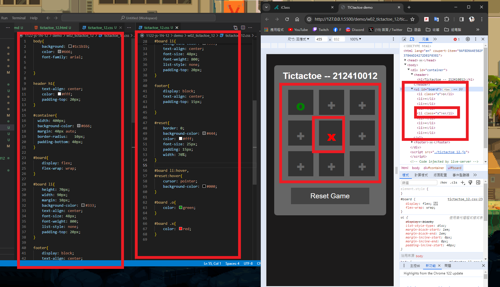
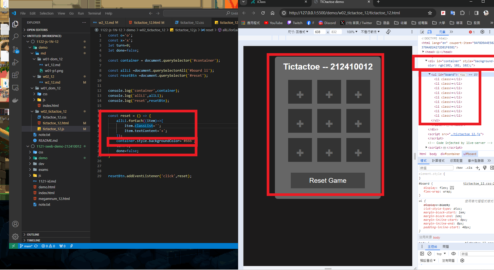
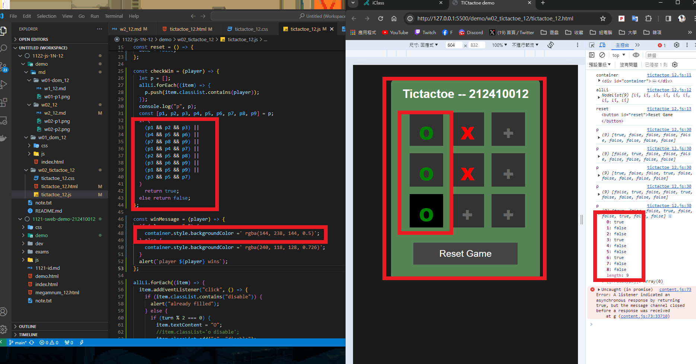
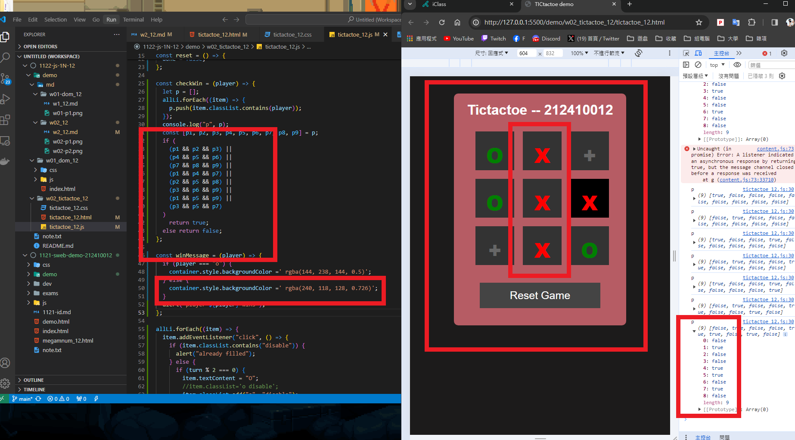
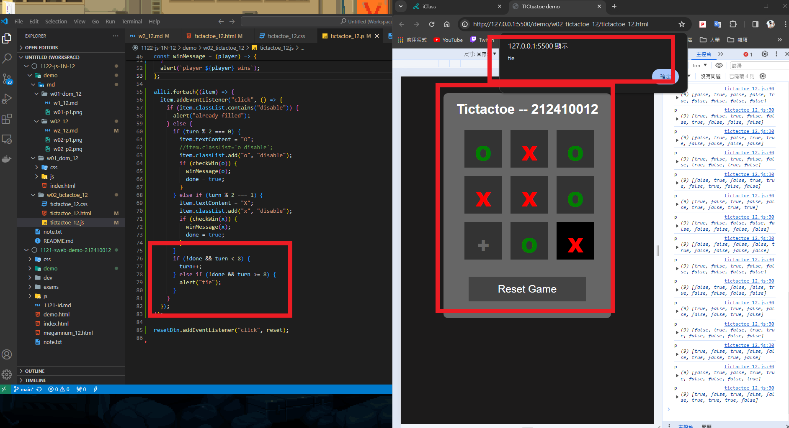

### W02-P1: Show Tictactoe css
 


```

```
### W02-P2: implement reset button
 


```

```
### W02-P3: implment checkWin(player), and winMessage(player)
 
#### => player O wins
 

 
#### => player X wins
 

 
#### => tie game
 


```

```
### W02-P4: git logs for W02

```

```
