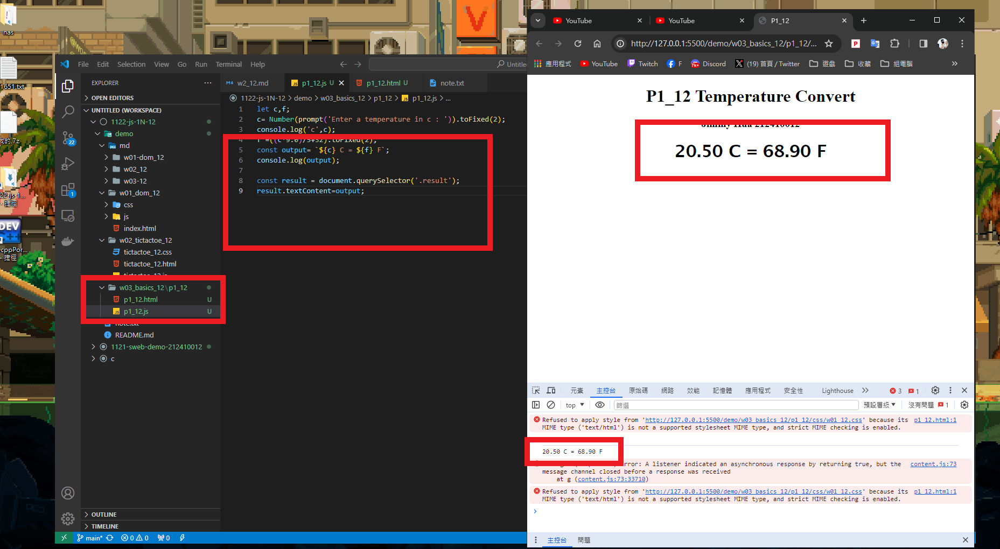
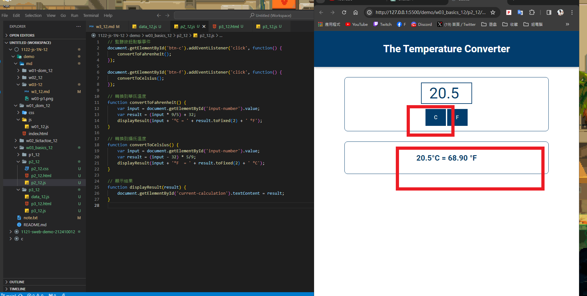
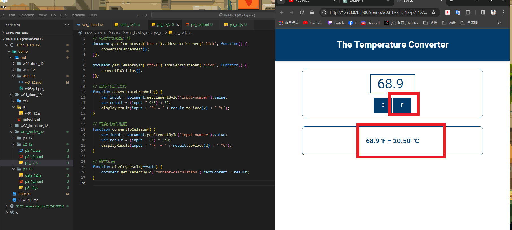
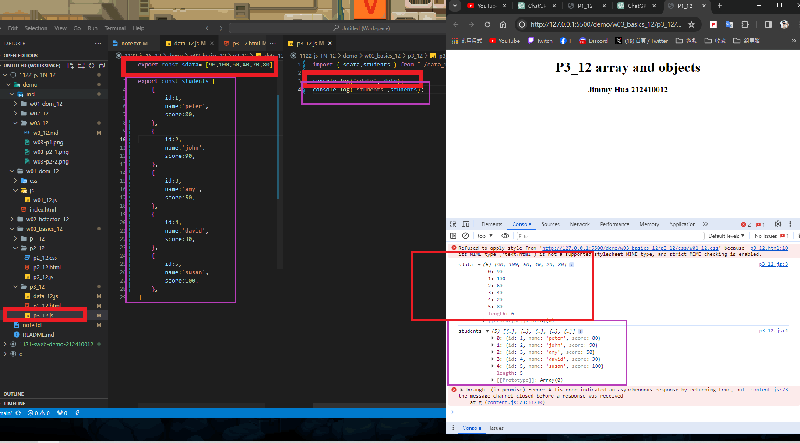

### W03-P1: P1_xx temperature convert
 


```
3e2d5ab jimmyhua123     Thu Mar 7 19:46:32 2024 +0800   ### W03-P1: P1_xx temperature convert
```
### W03-P2: P2_xx temperature convert using Web
 
##### => From C to F
 

 
##### => From F to C
 


```
0ec224d jimmyhua123     Thu Mar 7 20:06:08 2024 +0800   W03-P2: P2_xx temperature convert using Web
```
### W03-P3: import sdata and students data from data_xx.js
 
 



```


```
d6722b4 jimmyhua123     Sun Mar 3 22:02:32 2024 +0800   ### W02-P3: implment checkWin(player), and winMessage(player)
3bd79cd jimmyhua123     Sun Mar 3 21:28:26 2024 +0800   ### W02-P2: implement reset button
c51e1e3 jimmyhua123     Sun Mar 3 21:07:15 2024 +0800   W02-P1: Show Tictactoe css
```
