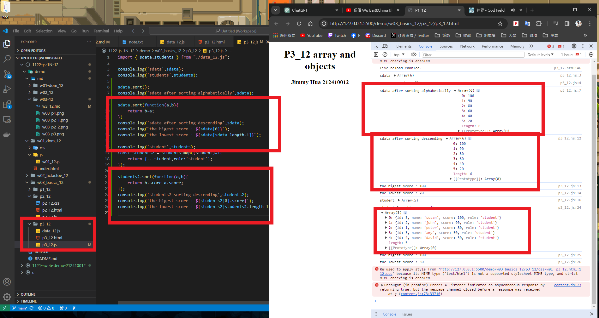

### W03-P1: P1_xx temperature convert
 


```
3e2d5ab jimmyhua123     Thu Mar 7 19:46:32 2024 +0800   ### W03-P1: P1_xx temperature convert
```
### W03-P2: P2_xx temperature convert using Web
 
##### => From C to F
 

 
##### => From F to C
 


```
0ec224d jimmyhua123     Thu Mar 7 20:06:08 2024 +0800   W03-P2: P2_xx temperature convert using Web
```
### W03-P3: import sdata and students data from data_xx.js
 
 


```

ff7e4b9 jimmyhua123     Thu Mar 7 20:14:10 2024 +0800   W03-P3: import sdata and students data from data_xx.js  
```
### W03-P4: Compute highest and lowest score of sdata and students2


```
1e9c1a1 jimmyhua123     Fri Mar 8 02:04:22 2024 +0800   ## W03-P4: Compute highest and lowest score of sdata and students2
```

### W03-P5: git logs for W03
 
```

 1e9c1a1 jimmyhua123     Fri Mar 8 02:04:22 2024 +0800   ## W03-P4: Compute highest and lowest score of sdata and students2
ff7e4b9 jimmyhua123     Thu Mar 7 20:14:10 2024 +0800   W03-P3: import sdata and students data from data_xx.js      
0ec224d jimmyhua123     Thu Mar 7 20:06:08 2024 +0800   W03-P2: P2_xx temperature convert using Web
3e2d5ab jimmyhua123     Thu Mar 7 19:46:32 2024 +0800   ### W03-P1: P1_xx temperature convert
 
```