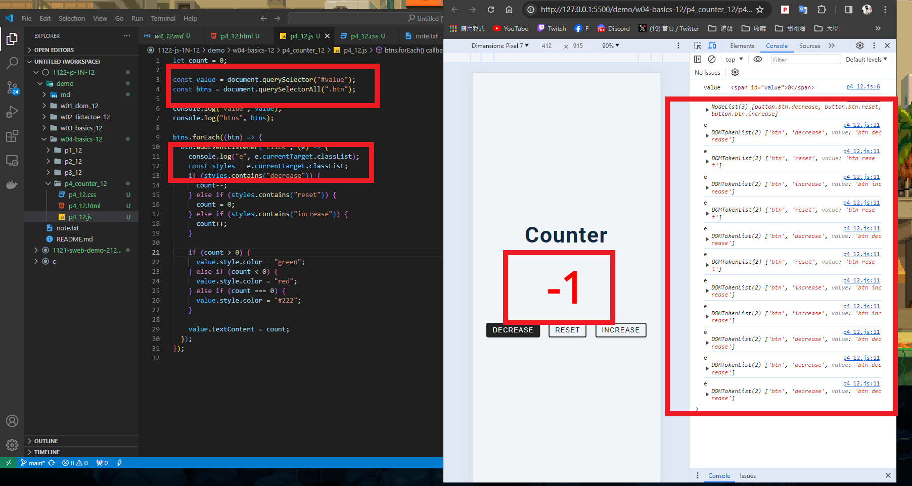
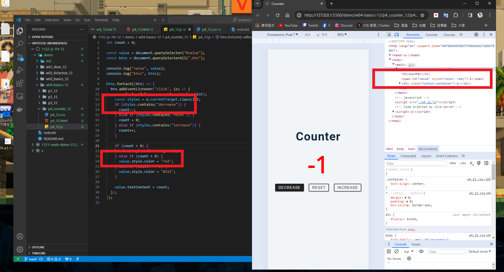
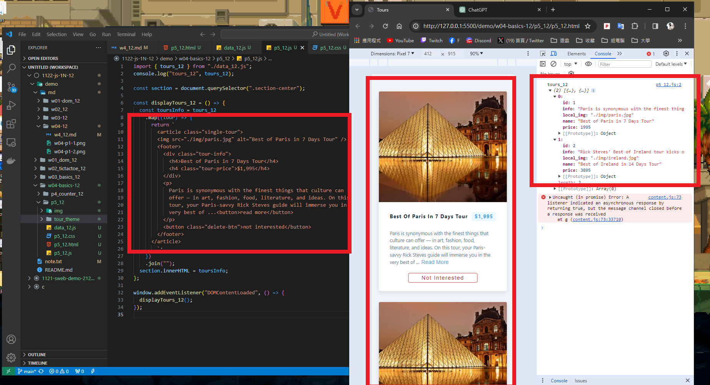
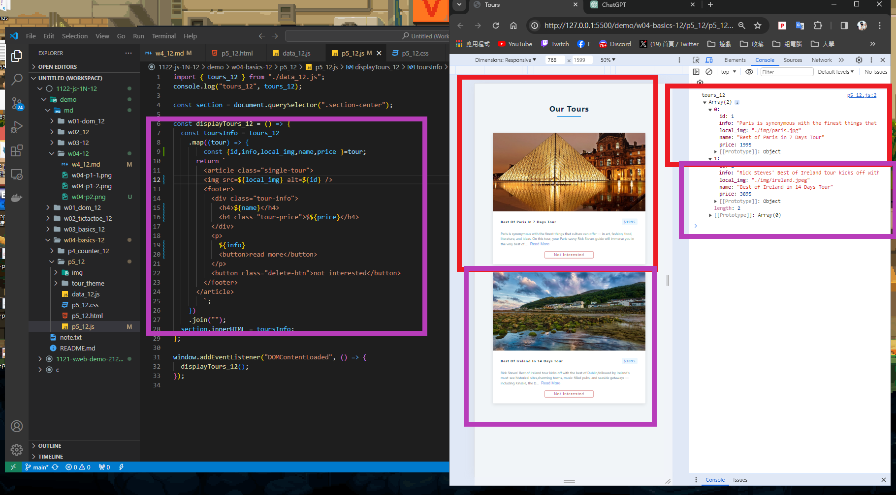
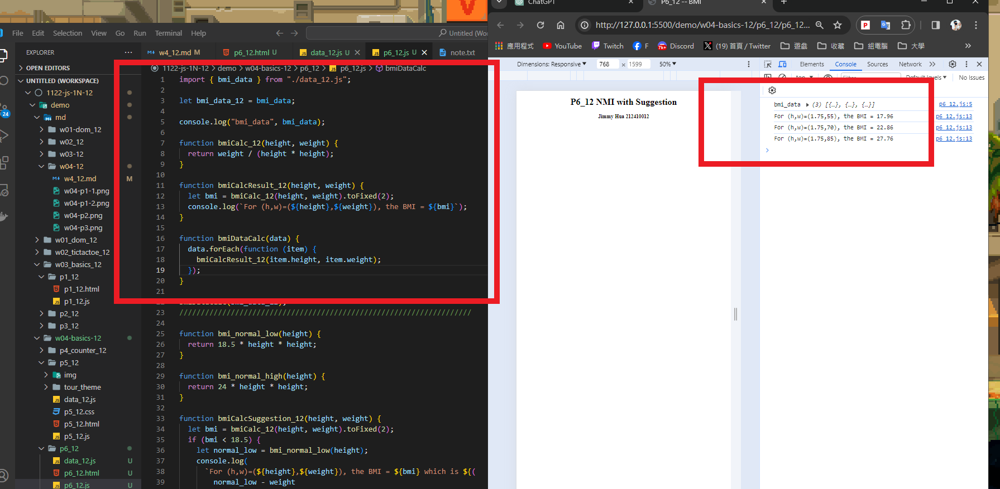
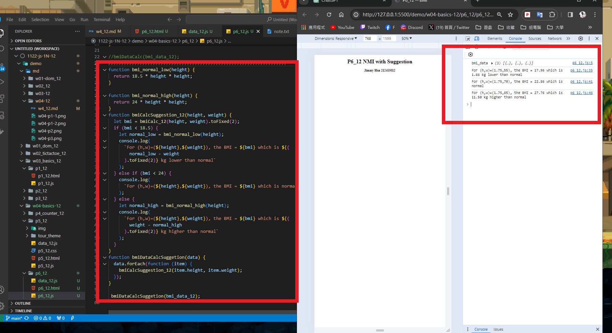

### ### W04-P1: P4_xx -- Counter Demo
 

 

 

```
782b50a jimmyhua123     Sun Mar 17 16:39:10 2024 +0800  ### W04-P1: P4_xx -- Counter Demo
```
### W04-P2: P5_xx -- Tours display two fixed data
 

 

```
0e77131 jimmyhua123     Sun Mar 17 17:31:24 2024 +0800   W04-P2: P5_xx -- Tours display two fixed data
```
### W04-P3: P5_xx -- Display 5 tours from data_xx.js (json array)
 


```


```
#W04-P4: P6_xx -- BMI Compute with Suggestion
 
#### => bmiDataCalc(bmi_data_xx);
 

 
#### => bmiDataCalcSuggestion(bmi_data_xx);
 

```

```

### W04-P5: git logs for W04
 
```

 
```