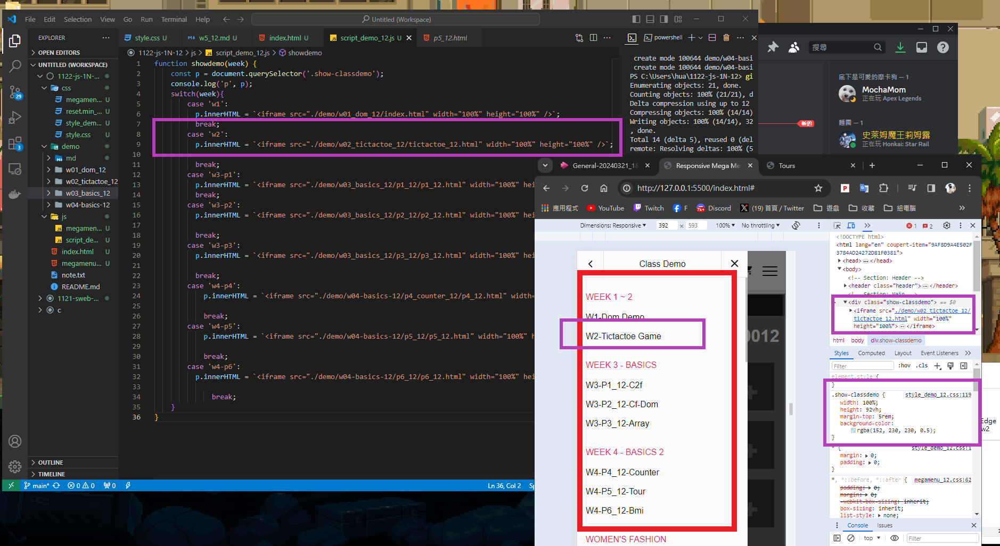
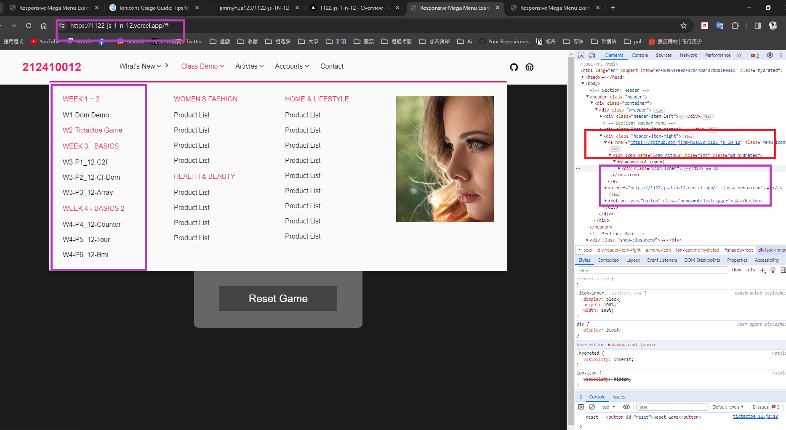
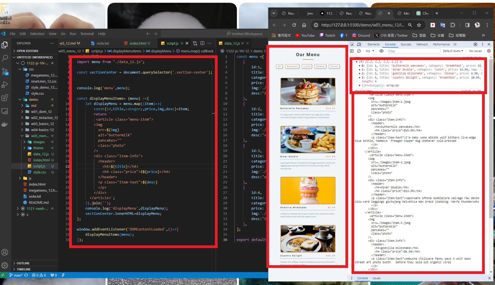
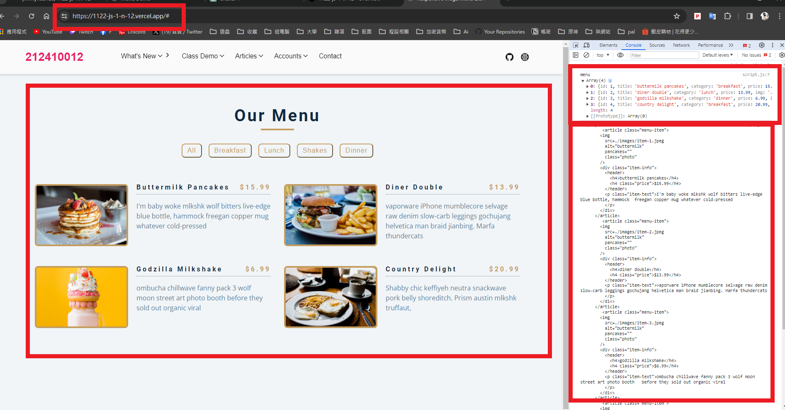
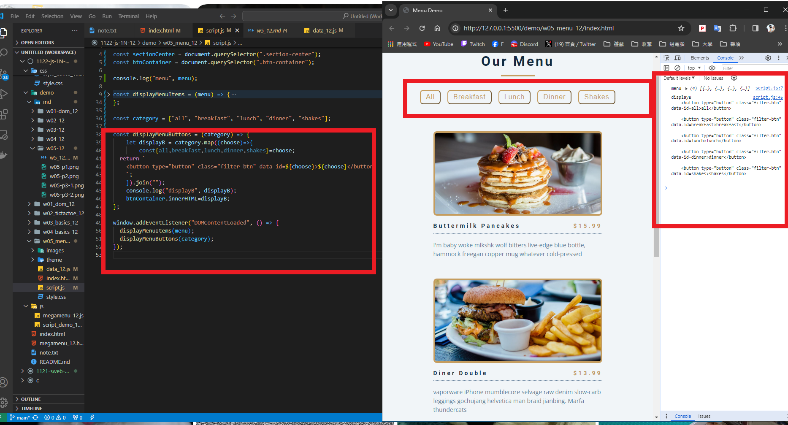

### ### W05-P1: W05-P1: Use megamenu to show class demo w1~W4 locally
 


```
ceab8cf jimmyhua123     Fri Mar 22 02:47:26 2024 +0800   W05-P1: Use megamenu to show class demo w1~W4 locally
```
### W05-P2: Show W05-P1 in Vercel, add github and globe icons for Github and Vercel
 
 

```
6762572 jimmyhua123     Fri Mar 22 03:09:05 2024 +0800   W05-P2: Show W05-P1 in Vercel, add github and globe icons for Github and Vercel
2b0cd7e jimmyhua123     Fri Mar 22 03:04:30 2024 +0800   add vercel
afb35a0 jimmyhua123     Fri Mar 22 02:57:31 2024 +0800   add icons
```
### W05-P3: Display Menu Items from menu json array on both local and Vercel

#### > local
 

 
#### > Vercel
 

 
```
d81c5d1 jimmyhua123     Fri Mar 22 12:59:24 2024 +0800   W05-P3: Display Menu Items from menu json array on both local and Vercel
1f4415f jimmyhua123     Fri Mar 22 12:56:26 2024 +0800   add w5
201e39b jimmyhua123     Fri Mar 22 12:51:48 2024 +0800   Display Menu Items from menu json array6762572 jimmyhua123 
```
### W05-P4: Display Menu buttons from categories array (do it by yourself)
 

```
```

### W05-P5: git logs for W5
 
```

```