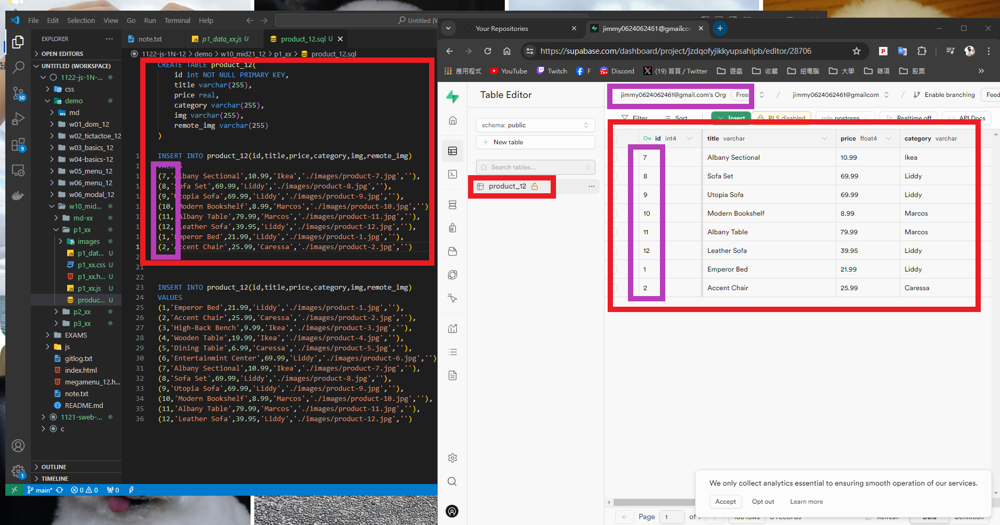
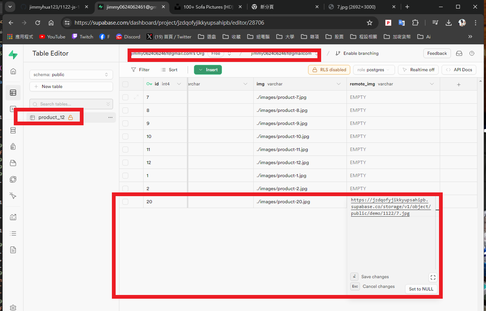
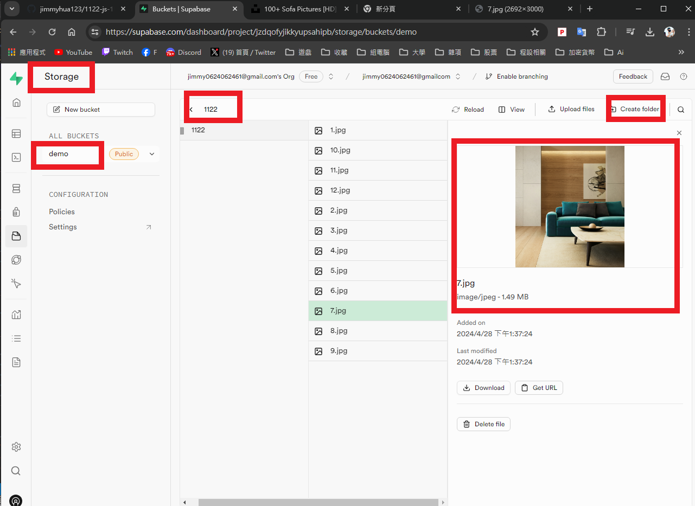
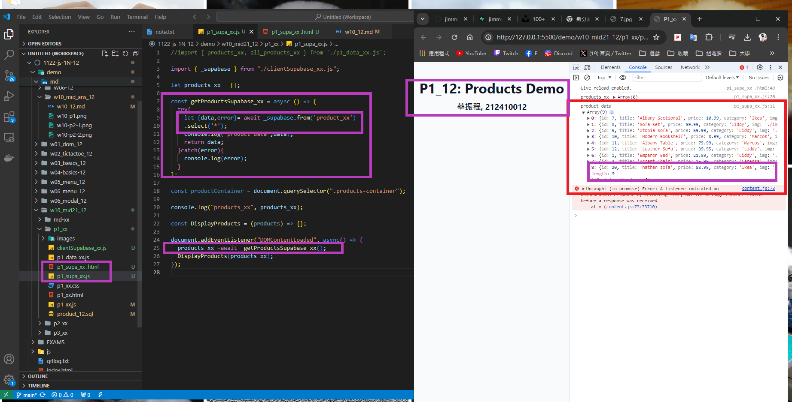
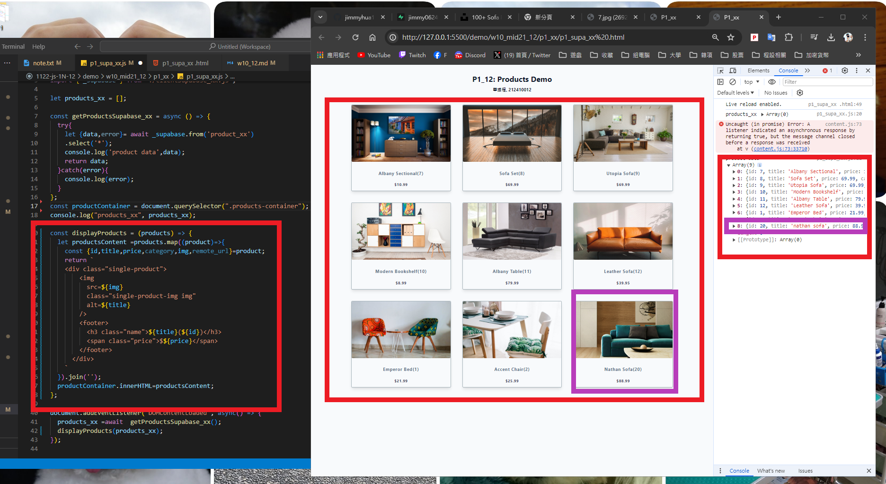

[My Github URL](https://github.com/jimmyhua123/1122-js-1N-12)

### W10-P1: In Supabase, create product_xx table with 8 product data


```
4501075 jimmyhua123     Sun Apr 28 13:31:02 2024 +0800   W10-P1: In Supabase, create product_xx table with 8 product data
```
### W10-P2: Get a photo from unsplash, and put it into storage in Supabase
 
 

 


```
fde6638 jimmyhua123     Sun Apr 28 13:47:23 2024 +0800   W10-P2: Get a photo from unsplash, and put it into storage in Supabase
```
### W10-P3: Get 9 products data from Supabase, and show in console


 
 
```
e0cbb35 jimmyhua123     Sun Apr 28 14:23:43 2024 +0800   ### W10-P3: Get 9 products data from Supabase, and show in console
```
###  W10-P4: Show products retrieved from Supabase
 

```

```

### W10-P5: git logs for W10

 
```


```
