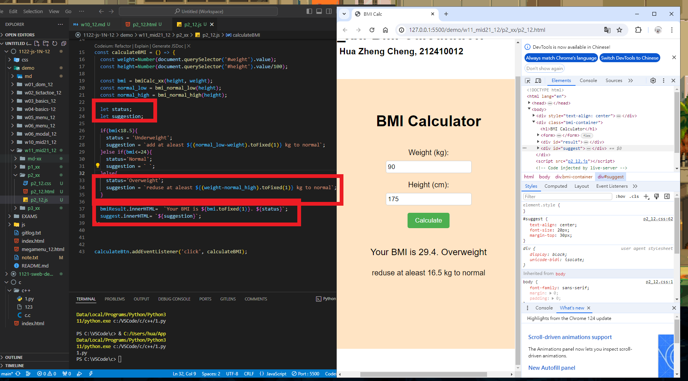
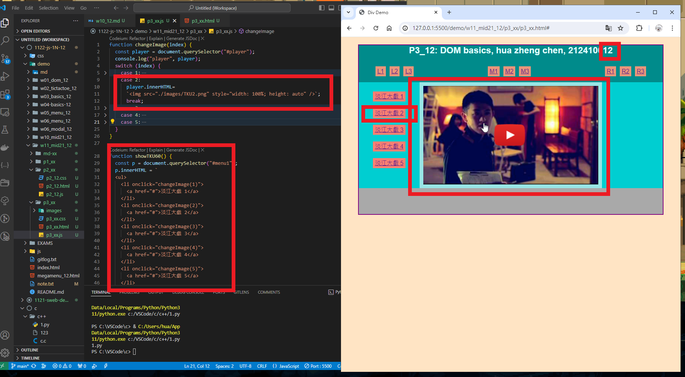
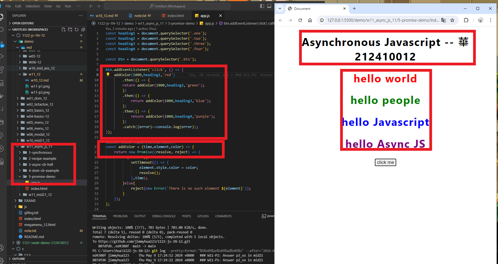
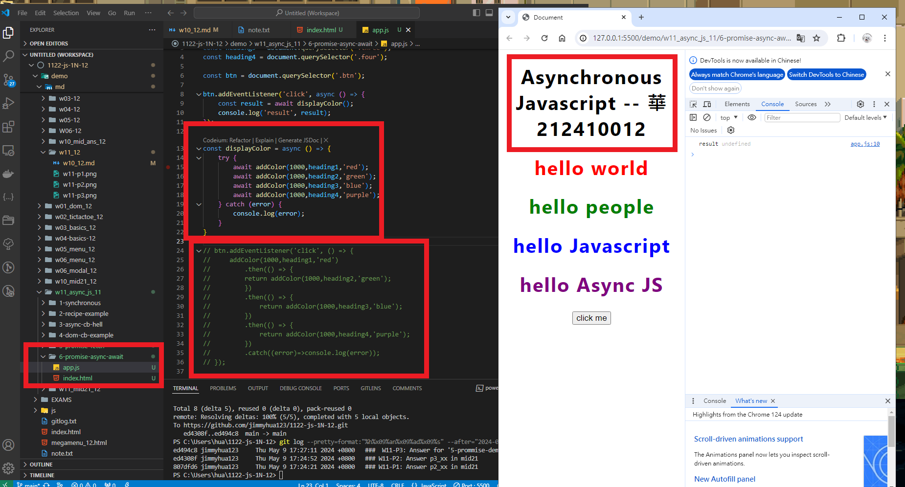

[My Github URL](https://github.com/jimmyhua123/1122-js-1N-12)

### W11-P1: Answer p2_xx in mid21
 

 
```
807dfd6 jimmyhua123     Thu May 9 17:24:21 2024 +0800   ### W11-P1: Answer p2_xx in mid21
```
### W11-P2: Answer p3_xx in mid21
 

 
```
ed4308f jimmyhua123     Thu May 9 17:24:52 2024 +0800   ### W11-P2: Answer p3_xx in mid21

```

###  W11-P3: Answer for '5-prommise-demo'

 
 
```
ed494c8 jimmyhua123     Thu May 9 17:27:11 2024 +0800   ###  W11-P3: Answer for '5-prommise-demo'
```
### W11-P4: Answer for '6-prommise-async-await'
 

```
98bd082 jimmyhua123     Thu May 9 17:36:03 2024 +0800   ### W11-P4: Answer for '6-prommise-async-await'

```

### W11-P5: git logs for W11
 
```
98bd082 jimmyhua123     Thu May 9 17:36:03 2024 +0800   ### W11-P4: Answer for '6-prommise-async-await'
ed494c8 jimmyhua123     Thu May 9 17:27:11 2024 +0800   ###  W11-P3: Answer for '5-prommise-demo'
ed4308f jimmyhua123     Thu May 9 17:24:52 2024 +0800   ### W11-P2: Answer p3_xx in mid21
807dfd6 jimmyhua123     Thu May 9 17:24:21 2024 +0800   ### W11-P1: Answer p2_xx in mid21

```
