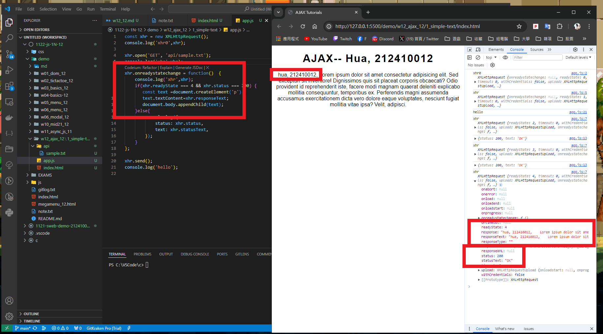
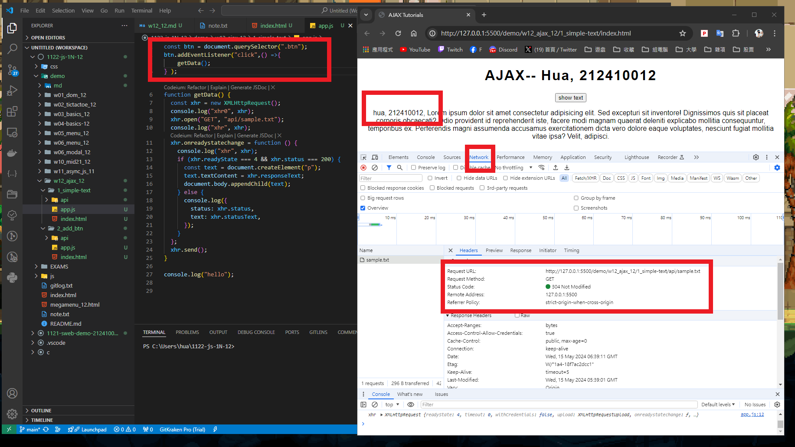
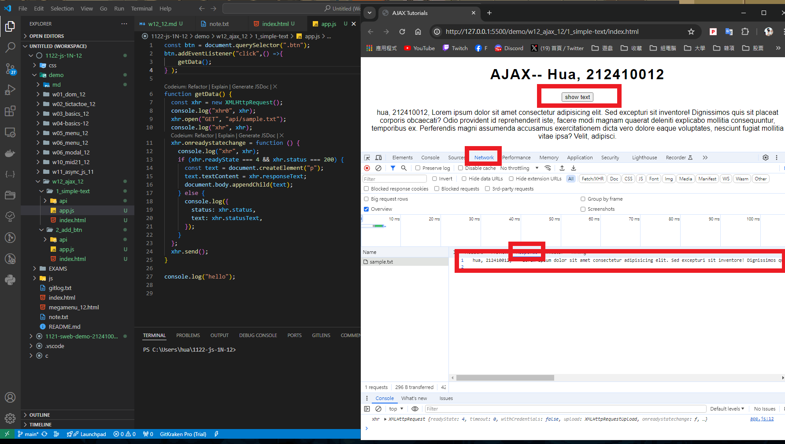
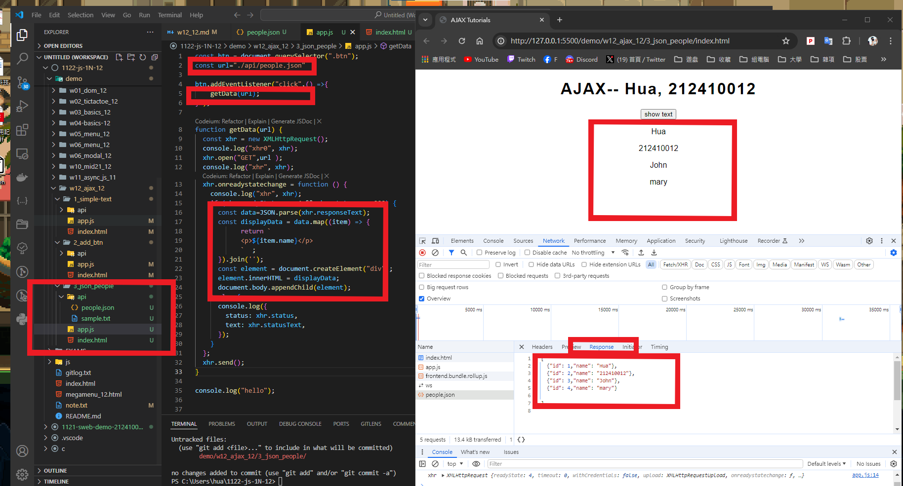
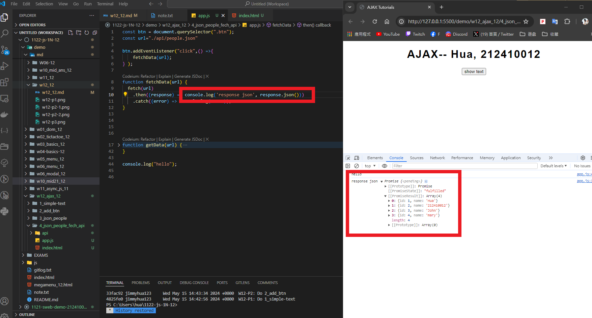
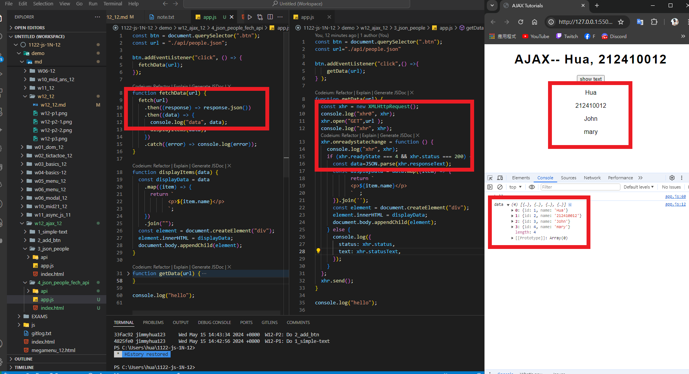
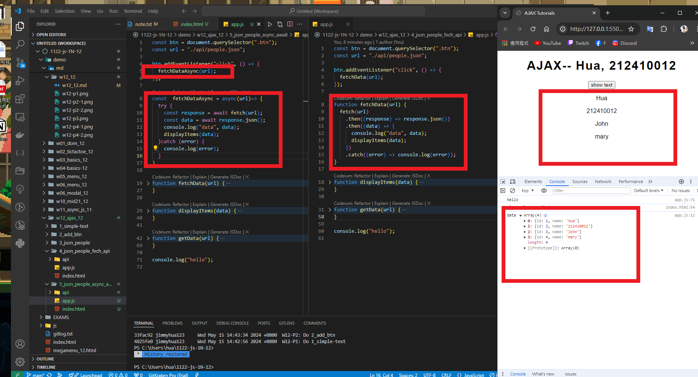

[My Github URL](https://github.com/jimmyhua123/1122-js-1N-12)

### W12-P1: Do 1_simple-text
 

 
```
```
### W12-P2: Do 2_add_btn
 
#### => Network, Header
 

 
#### => Network, Response
 

 
```

```

### W12-P3: Do 3_json_people_xhr
 

 
 
```
```
### W12-P4: Do 3_json_people_fetch_api
 
#### => fetch(url).then(response => response.json())
 

 
#### => fetch api vs.xhr
 

 
```

```

### W12-P5: Do 3_json_people_async_await
 

 
```

```
### W12-P6: git logs for W12
```

```