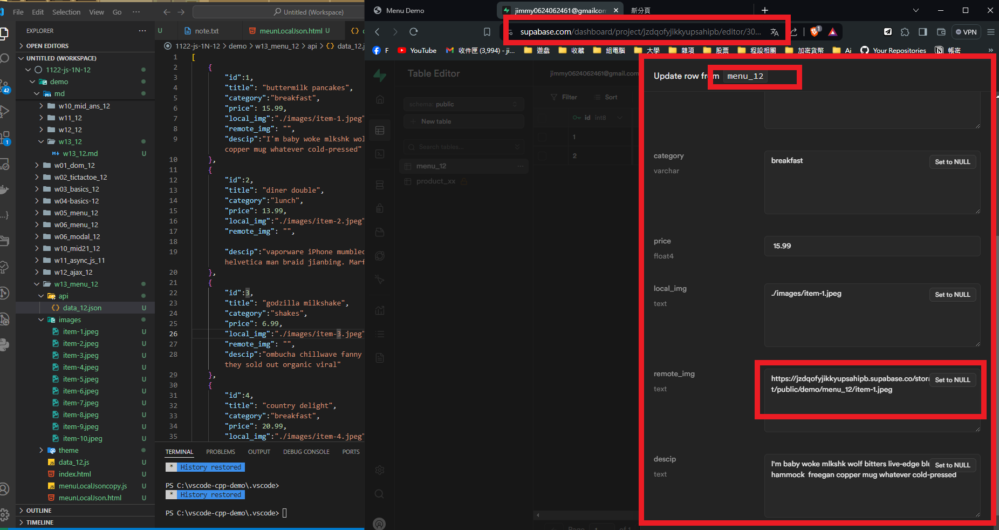

[My Github URL](https://github.com/jimmyhua123/1122-js-1N-12)

### W13-P1: Get 3 menu data from /api/data_xx.json
 
 
```


```
### W13-P2: Create 3 menu data from Supabase
 
#### => create menu_xx table, and add 1 menu data
 

 
#### => add RLS read policy for public access
 

 
#### => add two more menu data from SQL command
 

 
#### => show 3 menu data from menu_xx table
 

 
```

```

### W12-P3: Do 3_json_people_xhr
 

 
 
```
```
### W12-P4: Do 3_json_people_fetch_api
 
#### => fetch(url).then(response => response.json())
 

 
#### => fetch api vs.xhr
 

 
```

```

### W12-P5: Do 3_json_people_async_await
 

 
```

```
### W12-P6: git logs for W12
```
```