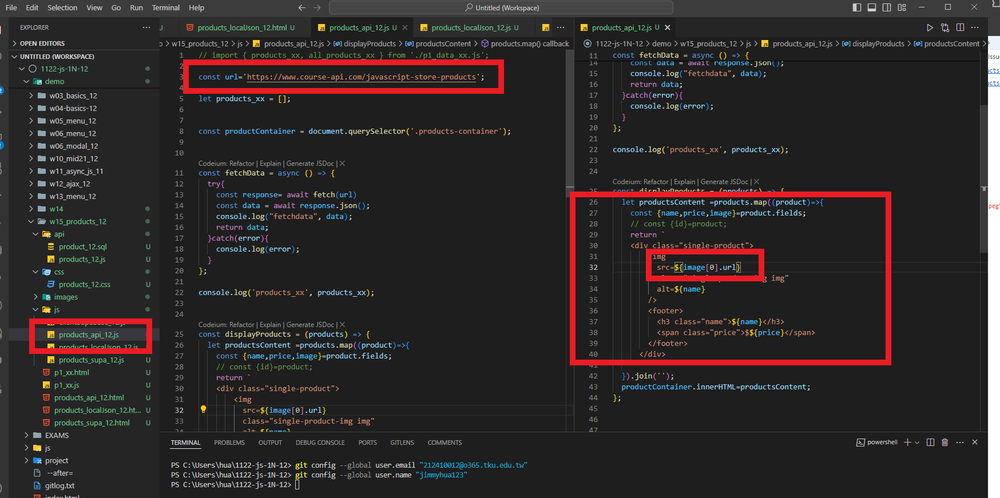

[My Github URL](https://github.com/jimmyhua123/1122-js-1N-12)

### W14-P1: Do products_api_xx.js to get data from an api url
 

 

```
bea085a jimmyhua123     Wed Jun 5 15:10:38 2024 +0800   W14-P1: Do products_api_xx.js to get data from an api url
```
### W14-P2: Do products_localJson_xx.js to get local json data (/api/productsData.json)
 

 

```
fbab150 jimmyhua123     Wed Jun 5 15:22:46 2024 +0800   W14-P2: Do products_localJson_xx.js to get local json data (/api/productsData.json)
```

### W14-P3: Use SQL to create schemas and data for company_xx and products_xx
 
#### => company_xx schema and data
 

 

 
#### => products_xx schema and data
 

 

 
```
d4c6c56 jimmyhua123     Wed Jun 5 15:48:19 2024 +0800   W14-P3: Use SQL to create schemas and data for company_xx and products_xx
```
### W14-P4: Do products_supa_xx.js to get data from Supabase
 

 
 
```
```

### W14-P5: git logs for W14
 
 
```

```