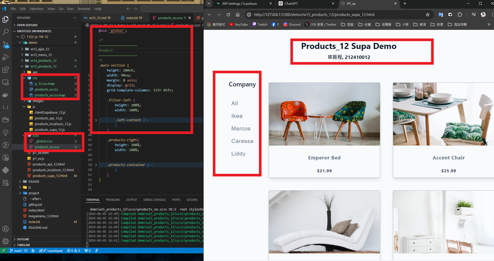
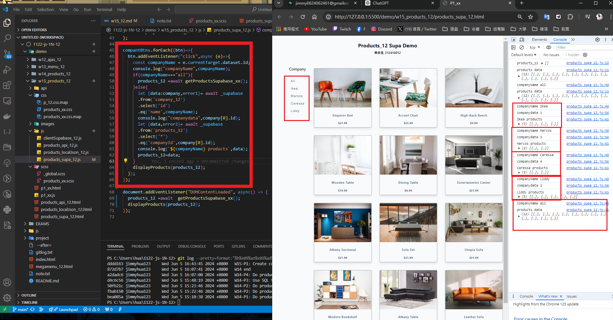
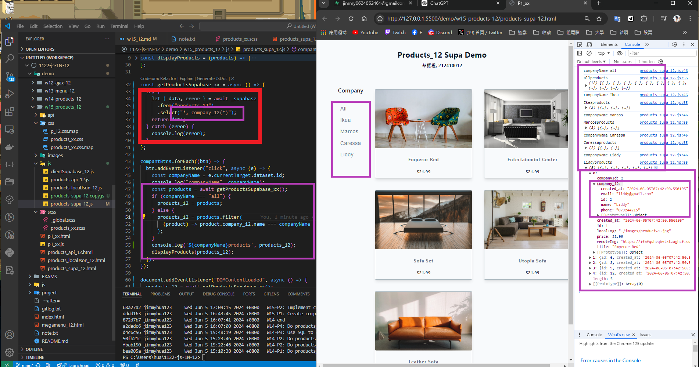
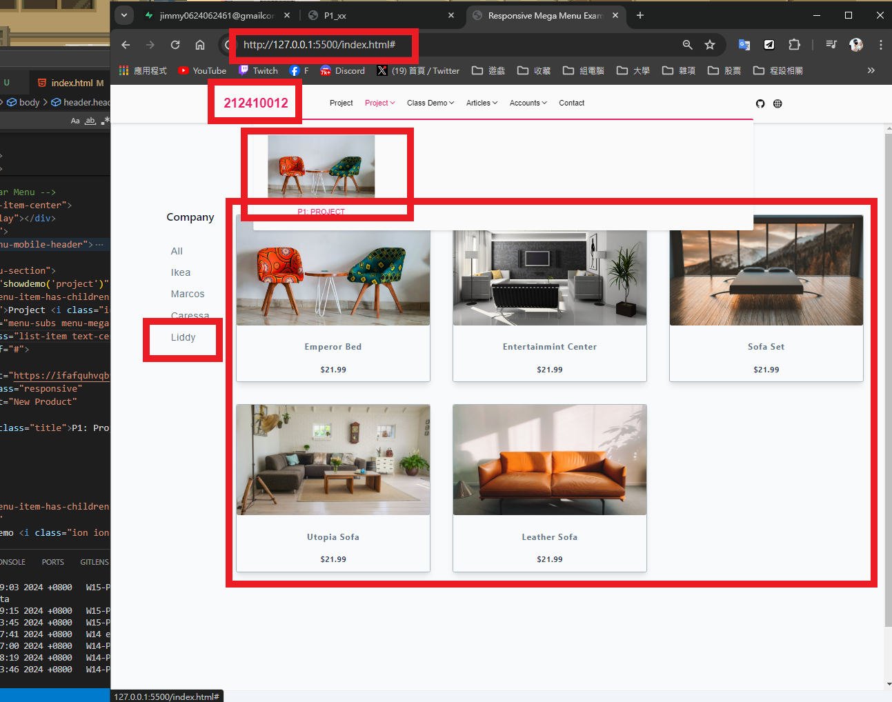
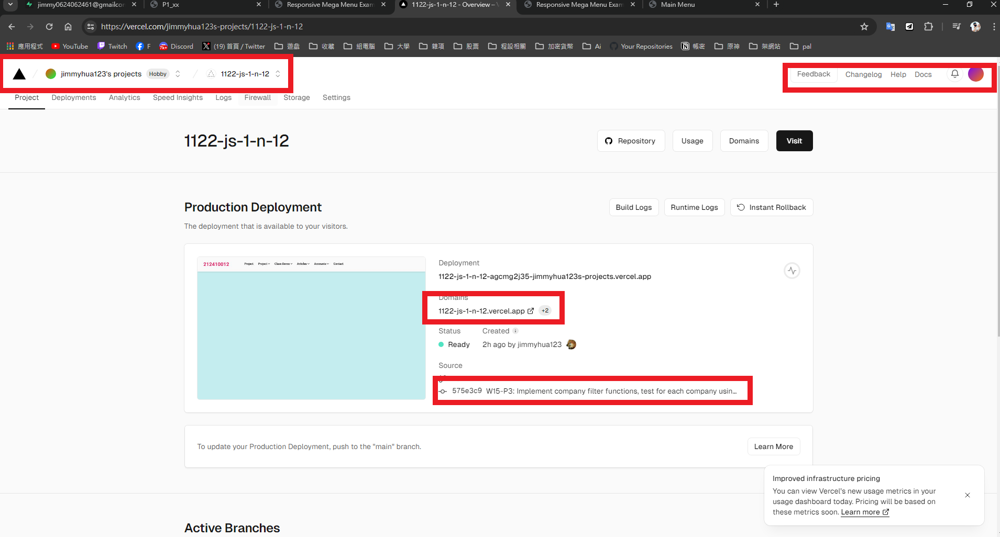
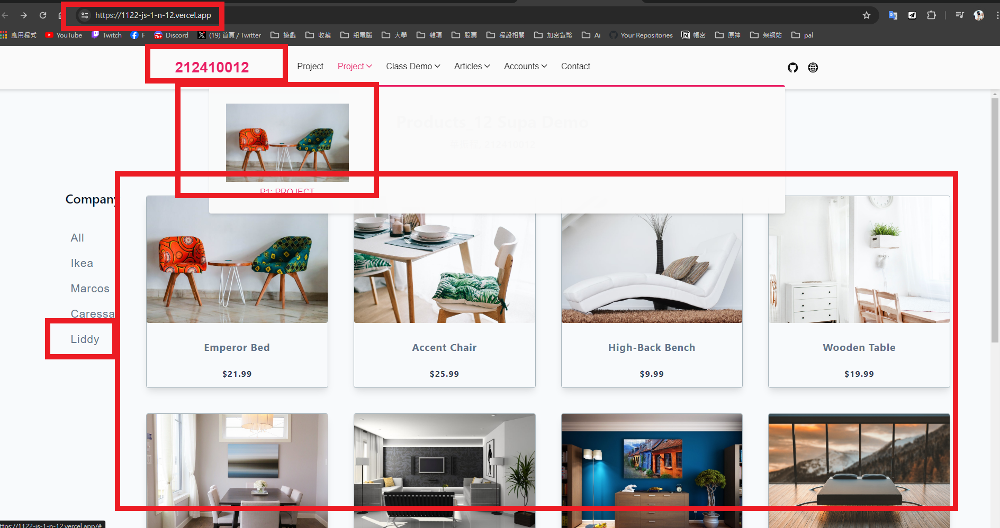

[My Github URL](https://github.com/jimmyhua123/1122-js-1N-12)

### W15-P1: Create company (filter) menu using scss
 

```
dddd163 jimmyhua123     Wed Jun 5 16:43:45 2024 +0800   W15-P1: Create company (filter) menu using scss
```
### W15-P2: Implement company filter functions, test for each company
 

 
```
68a27a2 jimmyhua123     Wed Jun 5 17:09:15 2024 +0800   W15-P2: Implement company filter functions, test for each company
```

### W15-P3: Implement company filter functions, test for each company using direct filtering of the products containing company data
 

 
```

```
### W15-P4: Put w15-demo into project-demo, and make it run correctly
 
#### => local
 

 

 
#### => Vercel
 

 

 
```

```

### W13-P5: git logs for W13
 
 
```

```