[My Github URL](https://github.com/jimmyhua123/1122-js-1N-12)

[My Vercel URL](https://1122-js-1-n-12.vercel.app/)

# 網頁功能介紹
# 212410012 華振程 耗時 13hours
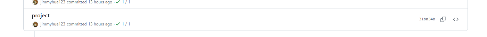
## 目錄
1. [登入與註冊](#登入與註冊)
2. [購物車功能](#購物車功能)
3. [結帳功能](#結帳功能)

## 登入與註冊

### 基本網頁長相
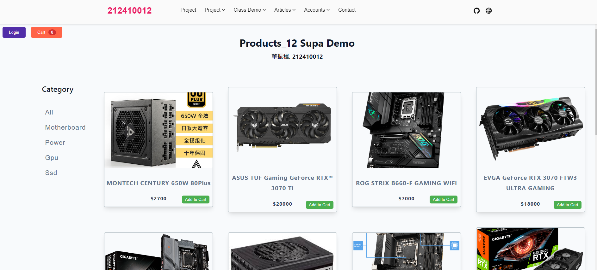
### 登入
用戶可以通過點擊頁面右上角的 **Login** 按鈕進行登入。
有**sign in / sign up** 登入/註冊 功能
登入/註冊表單包含電子郵件和密碼兩個字段。
用戶可以通過點擊 **Login** 按鈕後，再選擇 **Sign Up** 來進行註冊。註冊表單包含電子郵件、密碼等字段。
登入/註冊 成功或失敗都有提示，註冊的帳密會存到**SupaBase**

### sign in
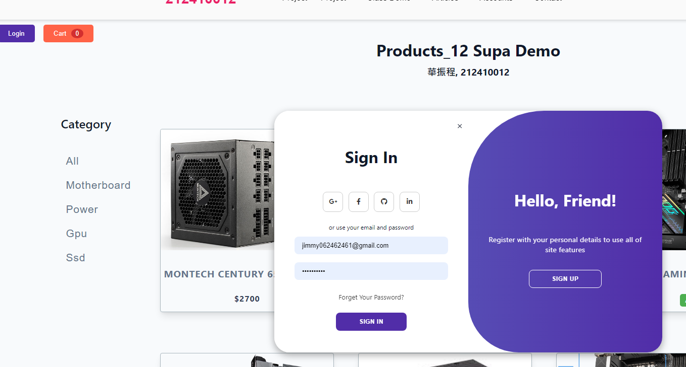
### sign up
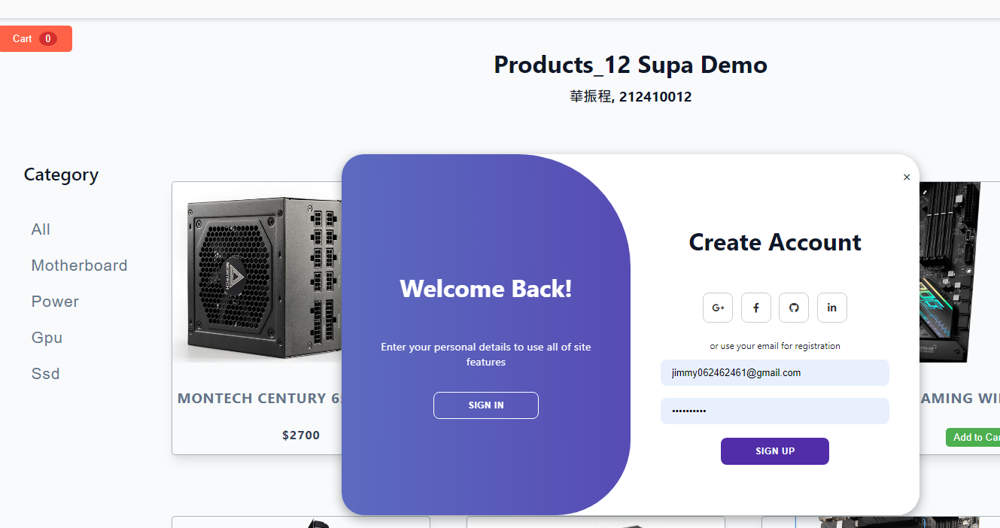


### 登入

#### 功能特點：

- **電子郵件檢查**：檢查電子郵件是否已存在於系統中。
- **驗證憑證**：確認用戶輸入的電子郵件和密碼是否正確。
- ### sign in failed
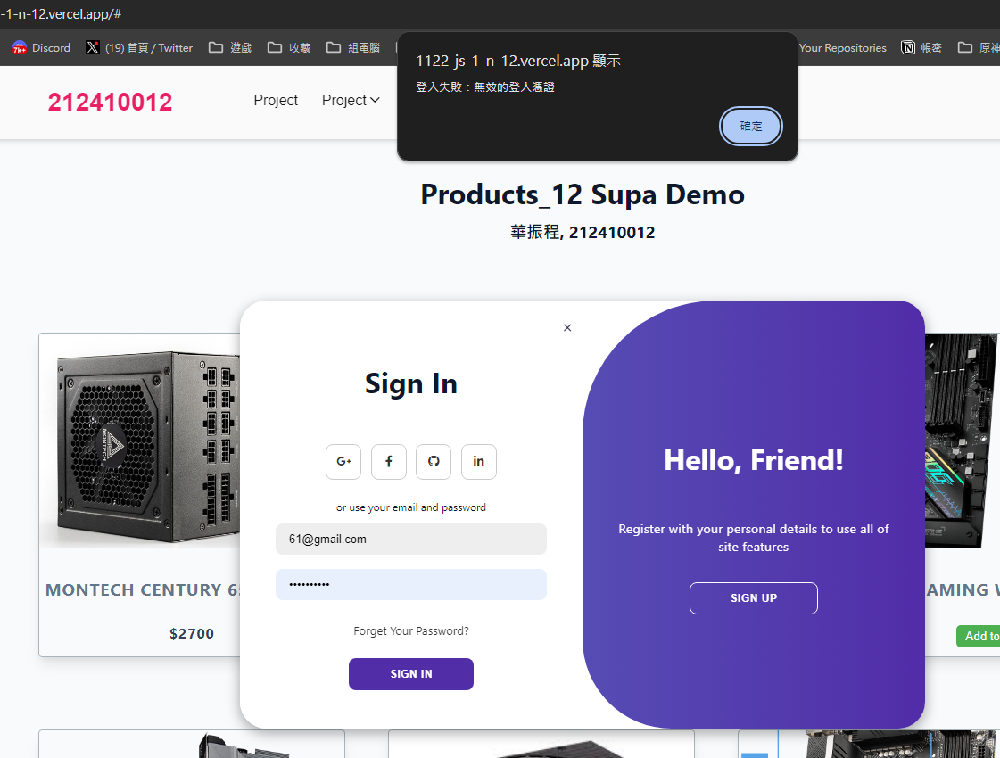
- ### sign in success
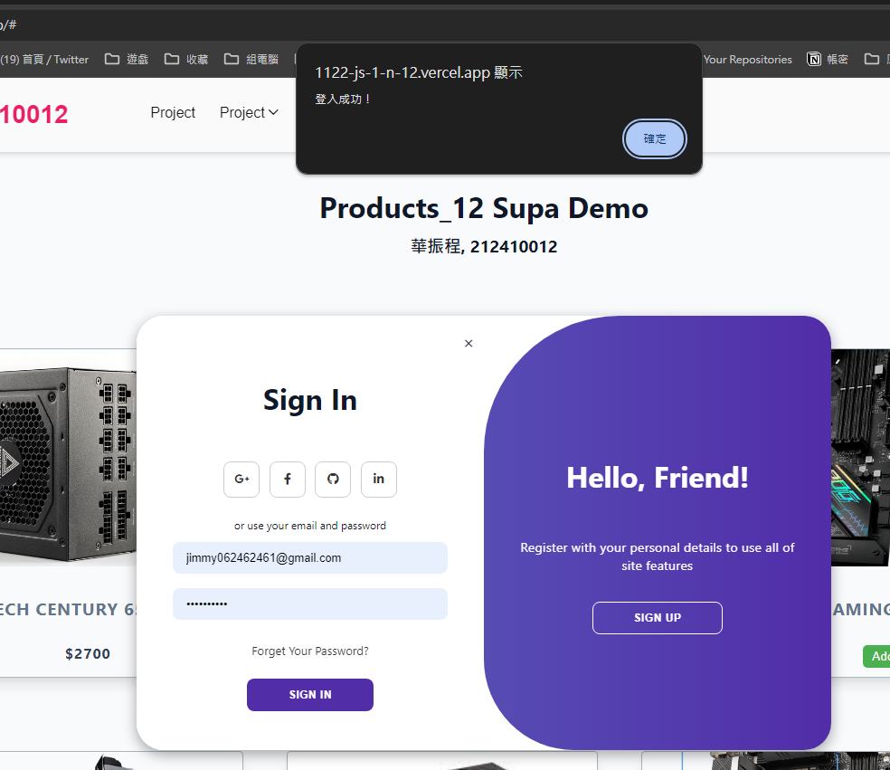

```javascript
const signInForm = document.getElementById("sign-in-form");
signInForm.addEventListener("submit", async (e) => {
    e.preventDefault();
    const email = document.getElementById('sign-in-email').value;
    const password = document.getElementById('sign-in-password').value;

    try {
        const { data, error } = await _supabase.auth.signInWithPassword({
            email,
            password,
        });

        if (error) throw error;
        alert('登入成功！');
        console.log('User:', data.user);

        // 顯示用戶信息
        userInfo.style.display = "flex";
        welcomeMessage.textContent = `歡迎回來, ${data.user.email}`;
        loginBtn.style.display = "none";
        container.style.display = "none";
    } catch (error) {
        if (error.status === 400 || error.status === 401) {
            alert('登入失敗：無效的登入憑證');
        } else {
            alert('登入失敗：' + error.message);
        }
        console.log(error);
    }
});
```

### 註冊

#### 功能特點：

- **電子郵件檢查**：在註冊過程中，系統會檢查用戶輸入的電子郵件是否已經被註冊。
- **用戶註冊**：成功註冊後，用戶會自動登入並看到歡迎信息。
- ### sign up failed
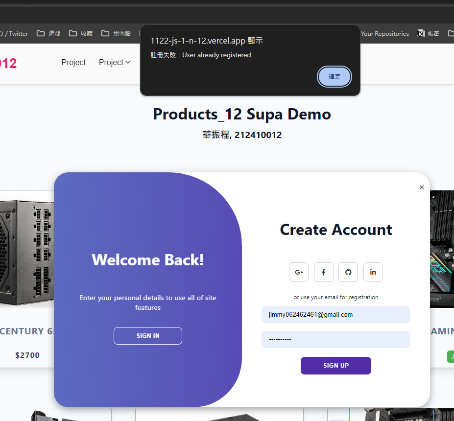
- ### sign up success
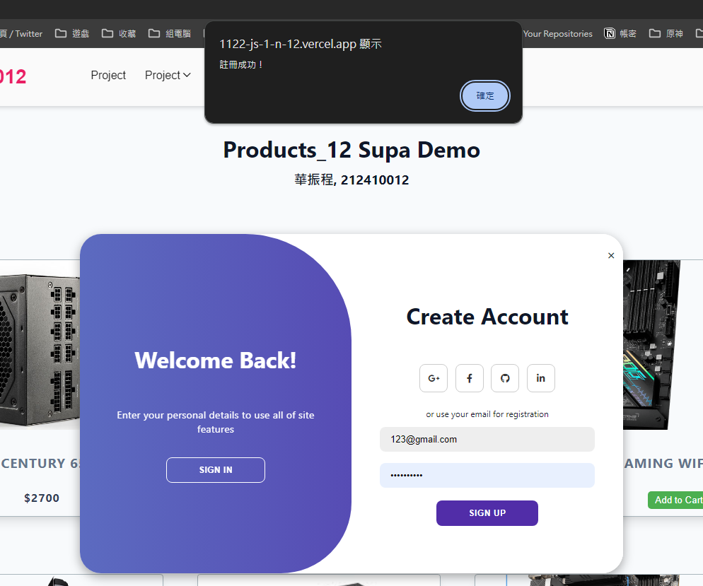
```javascript
const signUpForm = document.getElementById("sign-up-form");
signUpForm.addEventListener("submit", async (e) => {
    e.preventDefault();
    const email = document.getElementById('sign-up-email').value;
    const password = document.getElementById('sign-up-password').value;

    const emailExists = await checkEmailExists(email);
    if (emailExists) {
        alert('此電子郵件已經註冊過了！');
        return;
    }

    try {
        const { user, error } = await _supabase.auth.signUp({
            email,
            password,
        });

        if (error) throw error;
        alert('註冊成功！');
        console.log('User:', user);
    } catch (error) {
        if (error.status === 429) {
            alert('註冊失敗：註冊請求過多，請稍後再試');
        } else {
            alert('註冊失敗：' + error.message);
        }
        console.log(error);
    }
});
```
### after sign in 
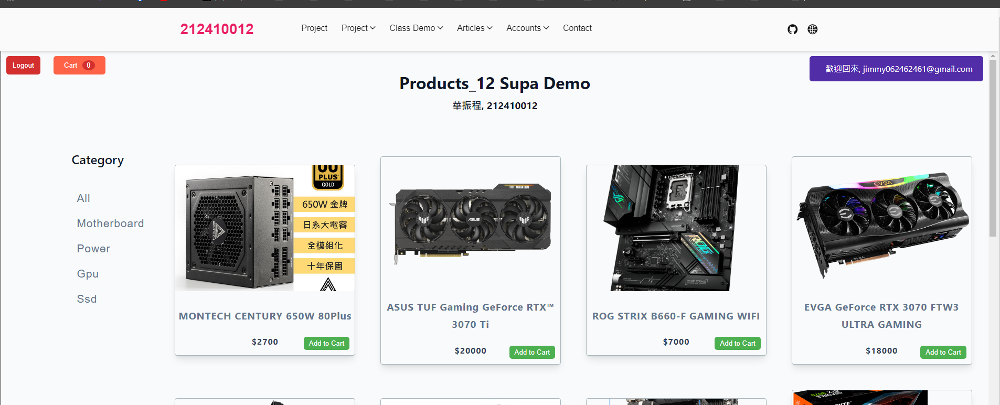
###  in supabase
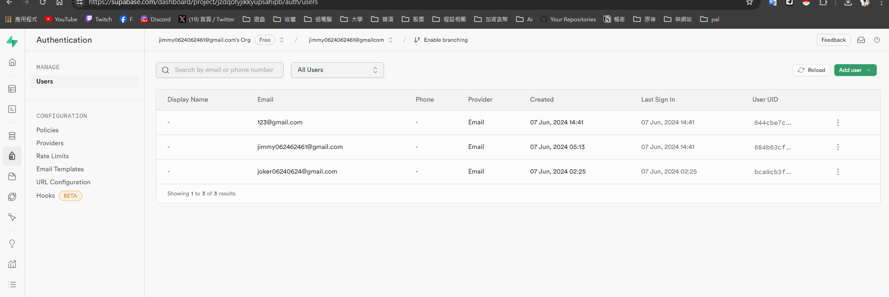

## 購物車功能

### cart
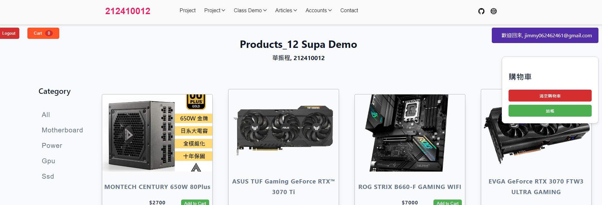


購物車功能允許用戶將產品添加到購物車，並顯示購物車內的商品及其數量。

### 添加商品到購物車

用戶可以通過點擊產品下方的 **Add to Cart** 按鈕將商品加入購物車。

### add to cart
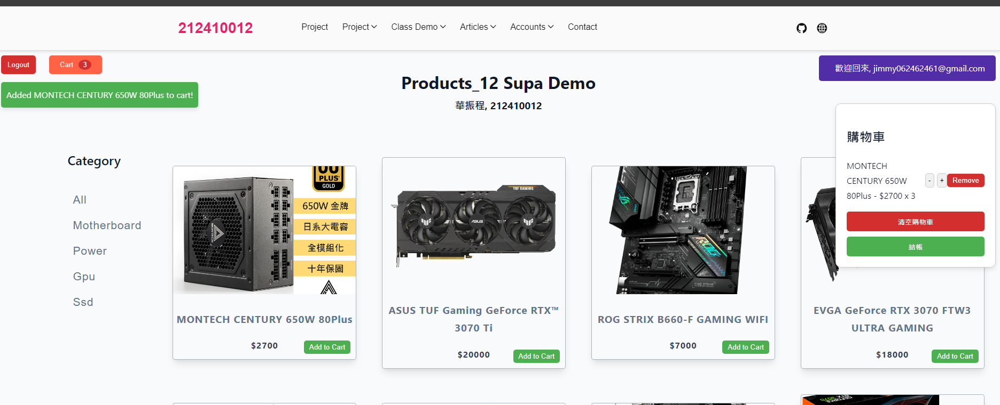
#### 功能特點：
- **商品數量更新**：每次添加商品時，購物車中的商品數量會自動更新。
- **提示信息**：添加商品後，頁面會顯示提示框，告知用戶商品已添加到購物車。

```javascript
const addToCart = (product) => {
    // 移除現有的提示框
    const existingAlertBox = document.querySelector('.alert-box');
    if (existingAlertBox) {
        existingAlertBox.remove();
    }

    // 創建新的提示框元素
    const alertBox = document.createElement('div');
    alertBox.className = 'alert-box';
    alertBox.textContent = `Added ${product.title} to cart!`;
    document.body.appendChild(alertBox);

    // 設置定時器，自動移除提示框
    setTimeout(() => {
        alertBox.style.opacity = '0';
        setTimeout(() => alertBox.remove(), 300);
    }, 3000); // 3秒後自動消失

    // 添加商品到購物車
    if (cart[product.title]) {
        cart[product.title].quantity += 1;
    } else {
        cart[product.title] = { ...product, quantity: 1 };
    }
    updateCart();
    updateCartCount(); // 更新購物車數量

    console.log(`Added ${product.title} to cart!`);
};
```

### 顯示購物車

用戶可以通過點擊頁面右上角的 **Cart** 按鈕查看購物車內容。
### cart


#### 功能特點：
- **顯示商品詳情**：購物車會顯示所有已添加的商品及其數量和價格。
- **更新商品數量**：用戶可以增加或減少購物車中的商品數量，或完全移除某個商品。
- **清空購物車**：購物車內提供清空按鈕，用戶可以一次性移除所有商品。

```javascript
const updateCart = () => {
    cartItems.innerHTML = Object.values(cart).map((item) => {
        return `
        <li class="cart-item">
            ${item.title} - $${item.price} x ${item.quantity}
            <div>
                <button class="decrease-btn" data-title="${item.title}">-</button>
                <button class="increase-btn" data-title="${item.title}">+</button>
            </div>
            <button class="remove-btn" data-title="${item.title}">Remove</button>
        </li>
        `;
    }).join("");

    // 綁定每個 "Decrease" 按鈕的點擊事件
    const decreaseBtns = document.querySelectorAll('.decrease-btn');
    decreaseBtns.forEach((btn) => {
        btn.addEventListener('click', (e) => {
            const title = e.target.dataset.title;
            decreaseQuantity(title);
        });
    });

    // 綁定每個 "Increase" 按鈕的點擊事件
    const increaseBtns = document.querySelectorAll('.increase-btn');
    increaseBtns.forEach((btn) => {
        btn.addEventListener('click', (e) => {
            const title = e.target.dataset.title;
            increaseQuantity(title);
        });
    });

    // 綁定每個 "Remove" 按鈕的點擊事件
    const removeBtns = document.querySelectorAll('.remove-btn');
    removeBtns.forEach((btn) => {
        btn.addEventListener('click', (e) => {
            const title = e.target.dataset.title;
            removeFromCart(title);
        });
    });
};

// 增加商品數量
const increaseQuantity = (title) => {
    cart[title].quantity += 1;
    updateCart();
    updateCartCount();
};

// 減少商品數量
const decreaseQuantity = (title) => {
    if (cart[title].quantity > 1) {
        cart[title].quantity -= 1;
    } else {
        delete cart[title];
    }
    updateCart();
    updateCartCount();
};

// 移除購物車中的商品
const removeFromCart = (title) => {
    delete cart[title];
    updateCart();
    updateCartCount(); // 更新購物車數量
};

// 清空購物車
clearCartBtn.addEventListener("click", () => {
    cart = {};
    updateCart();
    updateCartCount(); // 更新購物車數量
});

// 顯示和隱藏購物車
cartBtn.addEventListener("click", () => {
    cartContainer.style.display = cartContainer.style.display === "none" || cartContainer.style.display === "" ? "block" : "none";
});

// 更新購物車商品數量
const updateCartCount = () => {
    cartCount.textContent = Object.keys(cart).reduce((total, key) => total + cart[key].quantity, 0);
};
```


## 結帳功能

結帳功能允許用戶確認購物車中的商品並輸入配送信息以完成購買。

### 結帳流程

用戶可以通過點擊購物車內的 **Checkout** 按鈕進入結帳頁面。

### checkout
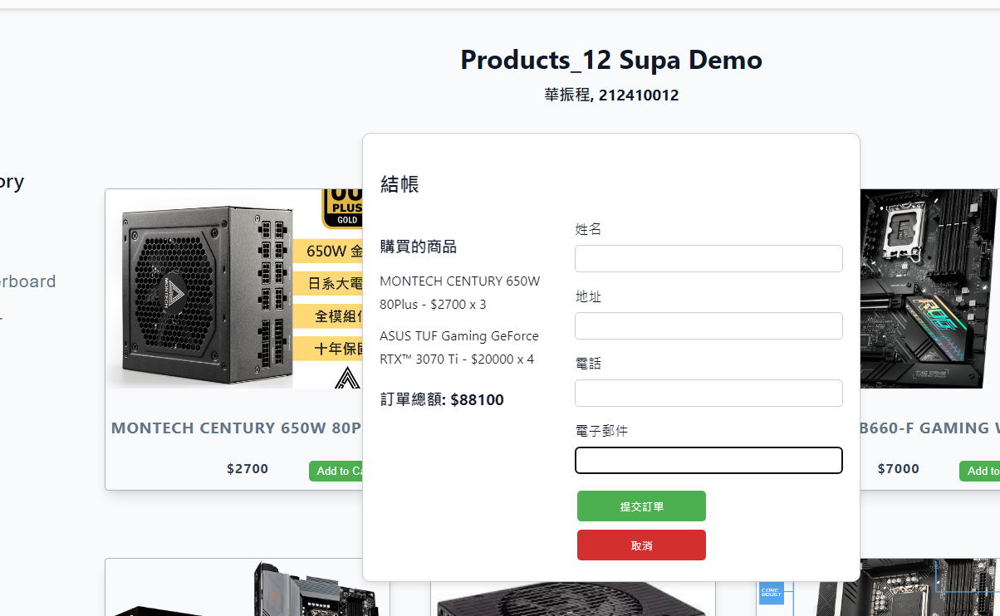
### checkout in SupaBase
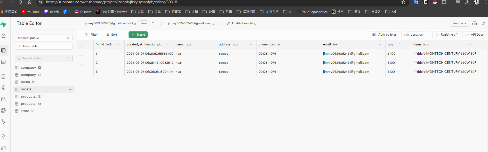

#### 功能特點：
- **顯示購買商品詳情**：結帳頁面左側顯示購物車中的所有商品及其總價。
- **填寫配送信息**：用戶需填寫姓名、地址、電話和電子郵件等配送信息。
- **提交訂單**：用戶點擊 **Submit Order** 按鈕提交訂單，訂單信息將被保存到數據庫。

```javascript
checkoutBtn.addEventListener("click", () => {
    const totalPrice = Object.values(cart).reduce((total, item) => total + item.price * item.quantity, 0);
    totalAmount.textContent = `$${totalPrice}`;
    updateCheckoutItems();
    checkoutContainer.style.display = "block";
    cartContainer.style.display = "none";
});

checkoutForm.addEventListener("submit", async (e) => {
    e.preventDefault();
    const name = document.getElementById("name").value;
    const address = document.getElementById("address").value;
    const phone = document.getElementById("phone").value;
    const email = document.getElementById("email").value;
    const total = Object.values(cart).reduce((total, item) => total + item.price * item.quantity, 0);
    const items = Object.values(cart).map(item => ({
        title: item.title,
        price: item.price,
        quantity: item.quantity
    }));

    console.log({ name, address, phone, email, total_amount: total, items }); // 打印要插入的數據以進行檢查

    const { data, error } = await _supabase
        .from('orders')
        .insert([
            { name, address, phone, email, total_amount: total, items }
        ]);

    if (error) {
        console.error("Error inserting order:", error);
        alert("提交訂單失敗！");
    } else {
        alert("訂單已提交！");
        cart = {};
        updateCart();
        updateCartCount(); // 更新購物車數量
        checkoutContainer.style.display = "none";
    }
});
```

### 取消結帳

用戶可以在結帳頁面點擊 **Cancel** 按鈕取消結帳，返回購物車頁面。


```javascript
cancelCheckoutBtn.addEventListener("click", () => {
    checkoutContainer.style.display = "none";
    cartContainer.style.display = "block";
});
```

### SupaBase 內部

#### SupaBase Table

#### Table1 products_xx 
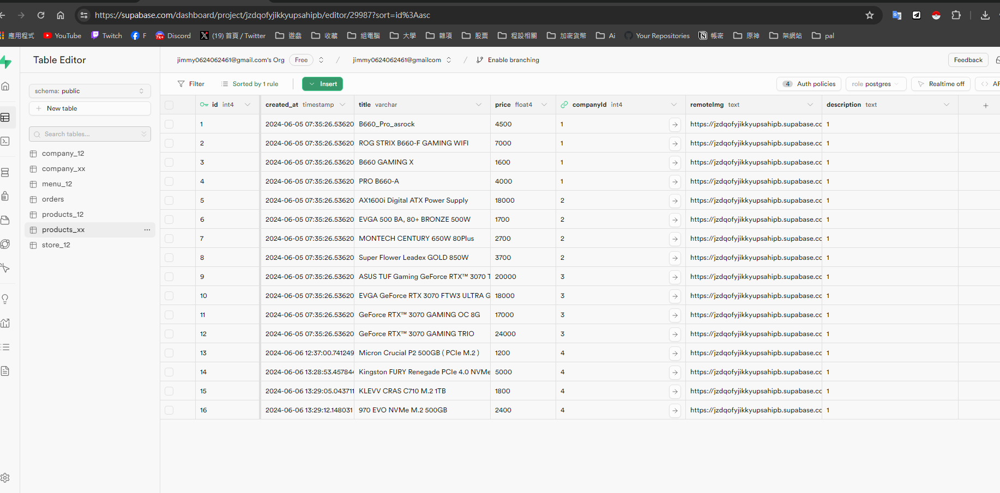

#### Table1 company_xx 
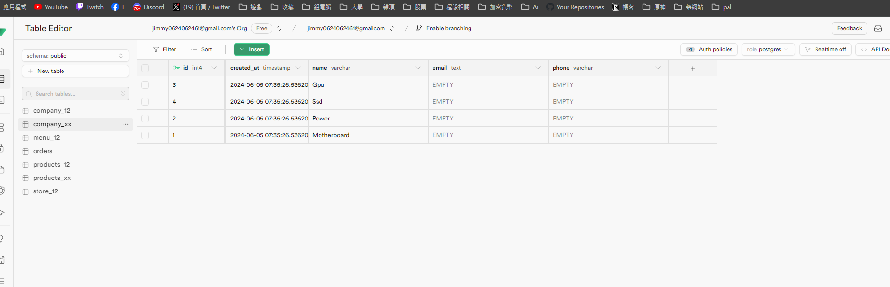

#### Table1 orders


#### 使用SupaBase 的內建auth 讓email功能可以使用
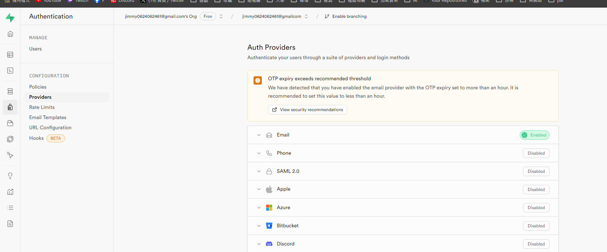

#### 使用SupaBase 的email功能 可以客製化郵件內容
#### 不過有 1.寄件次數限制2.無法驗證email (需要另外做驗證網站) 所以後來取消這功能
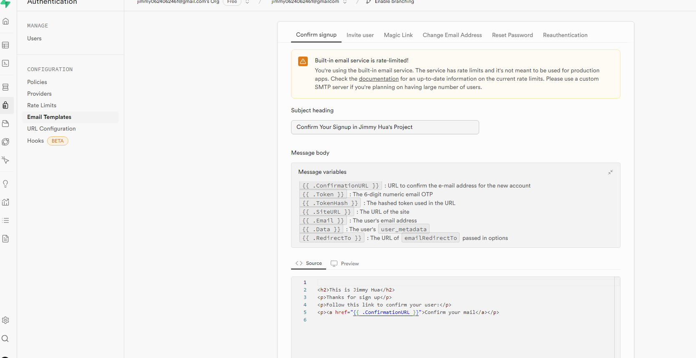
#### 使用SupaBase 的email功能示範 收到的郵件內容
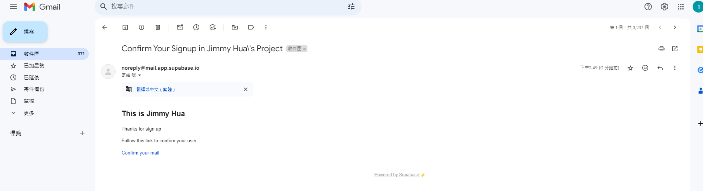


---
這個網頁提供了完整的購物體驗，包括登入、註冊、管理購物車和結帳的功能。